# 🌌 Once Human Cheat Software – Power, Awareness & Total Control

Step into the post-apocalyptic frontier fully prepared.
The **Once Human Cheat Software** delivers tactical dominance across exploration, combat, and crafting — offering **unlimited stamina**, **ESP tracking**, and **instant resource gain** for seamless survival progression.

Designed for **Windows 10/11**, this tool is built to perform smoothly with the latest game patches and works perfectly in **single-player** or **private world sessions**. Whether you’re gathering rare materials or exploring high-level contamination zones, it ensures your survival is effortless and efficient.

---

## ⚙️ Overview

The **Once Human Cheat Tool** merges quality-of-life enhancements with tactical systems designed for players who want **control without compromise**.
With ESP overlays, stamina regeneration, and real-time inventory modification, you’ll have the tools to explore, craft, and survive without grind.

[!NOTE]

> This tool is optimized for private or offline use and does not alter permanent save data.

### Key Advantages

* Unlimited stamina & sprinting ⚡
* ESP for loot, enemies, and NPCs 👁
* Instant crafting & building
* Resource and material multipliers
* Weapon durability freeze
* Real-time XP and energy control

---

## 🧩 Core Features

| Feature              | Description                                         |
| -------------------- | --------------------------------------------------- |
| **ESP Overlay**      | Shows enemies, allies, and resources through walls. |
| **Infinite Stamina** | Sprint and fight endlessly without fatigue.         |
| **Instant Crafting** | Complete builds and upgrades instantly.             |
| **Loot Radar**       | Highlights crates, materials, and hidden caches.    |
| **Durability Lock**  | Prevents gear from breaking or degrading.           |
| **XP Boost**         | Instantly increase level progression and abilities. |

---

## 💻 Compatibility

| Platform                     | Supported                        |
| ---------------------------- | -------------------------------- |
| **Windows 10 / 11 (64-bit)** | ✅                                |
| **Steam / Epic Launcher**    | ✅                                |
| **Private Sessions / Co-op** | ✅                                |
| **Anti-Detection System**    | Kernel cloaked, external overlay |

[!IMPORTANT]

> Avoid enabling features during public multiplayer matches — the system is tuned for **offline balance testing and sandbox play**.

---

## ⚡ Setup & Controls

1. **Download** the verified cheat package.
2. **Extract** to a new folder (avoid game root).
3. Run `OnceHuman_Cheat.exe` as Administrator.
4. Launch *Once Human* normally.
5. Wait for the loader to confirm connection, then use:

   ```bash
   F1 – Toggle ESP Overlay  
   F2 – Infinite Stamina  
   F3 – Instant Crafting  
   F4 – Add 10,000 Resources  
   F5 – Lock Durability  
   F6 – XP Boost  
   F7 – Freeze Enemy AI  
   F8 – Save Configuration  
   ```
6. Press **INSERT** to open the cheat dashboard in-game.

[!WARNING]

> Changing stamina or inventory values mid-event (raids, anomalies) may require one reload to sync properly.

---

### 🧠 Tool Process Diagram

```mermaid
flowchart TD
A[Start Loader] --> B[Detect Once Human Process]
B --> C{Feature Selection}
C -- ESP --> D[Render Entity Data Overlay]
C -- Stamina --> E[Set Value to Infinite]
C -- Crafting --> F[Reduce Build Timer to Zero]
C -- Resources --> G[Add Material Stack]
D --> H[Display In-Game Overlay]
E --> H
F --> H
G --> H
H --> I[Optimized Survival Performance 🌌]
```



---

## ⚙️ Configuration Example

Editable in `oncehuman_config.json`:

```json
{
  "esp_enemy_color": "#ff5050",
  "esp_loot_color": "#40ff40",
  "stamina_infinite": true,
  "instant_crafting": true,
  "xp_multiplier": 5,
  "resource_gain": 10000
}
```

### Popular Presets

* **Explorer Mode:** ESP + infinite stamina only.
* **Builder Mode:** Instant crafting + durability lock.
* **Survivor Mode:** All systems active — full control.

---

## ❓ FAQ

**Q: Does it support new season or patch updates?**
Yes. The cheat system auto-syncs with the latest Once Human build and map revisions.

**Q: Can I combine it with third-party mods?**
Yes. Fully compatible with UI, shader, and texture mods.

**Q: Will my save data be affected?**
No. All changes are session-based and revert after closing the game.

**Q: What’s the CPU/GPU impact?**
Less than 3% CPU usage — optimized for high-FPS environments.

**Q: Can I use it with co-op friends?**
Yes, as long as you host the session privately.

---

## 🏁 Final Thoughts

The **Once Human Cheat Software** gives you the flexibility to explore without fear, build without limits, and progress without grind.
Perfect for players who value efficiency and immersion, it transforms every session into a tailored experience of freedom and creativity.

Survive the unknown — on your own terms.

---

*© 2025 Once Human Cheat Software. Built for freedom, precision, and survival mastery.*
